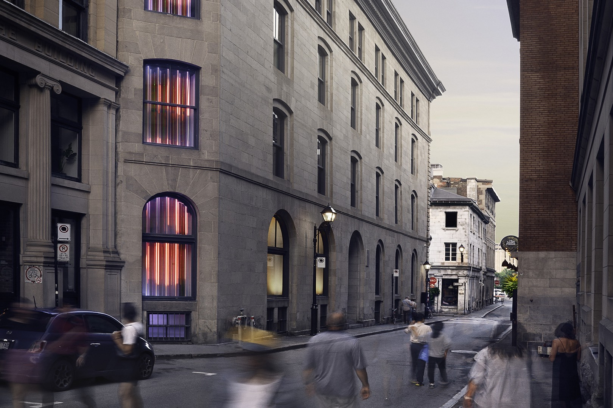

# Expo Jean-marc Vallé  
## Visite du 20 février 2025 au centre PHI (15 h 00)

*photo du centre PHI (internet)*

Le Centre Phi a ouvert ses portes en 2007 à Montréal. Il est un espace culturel situé à Montréal, au Canada, qui se distingue par sa programmation innovante dans les domaines de l'art, de la technologie et de la culture. Il propose une expérience immersive en offrant des expositions, des performances, des installations multimédia, des projections et des événements interactifs qui explorent les frontières entre l'art traditionnel et les nouvelles technologies.

Le Centre Phi met particulièrement l'accent sur l'innovation numérique et les projets immersifs, créant un dialogue entre l'art et les technologies émergentes telles que la réalité virtuelle, la réalité augmentée et les installations interactives. Il accueille des artistes locaux et internationaux, permettant au public de découvrir des œuvres avant-gardistes et de participer à des expériences culturelles uniques.

Avec son architecture moderne et ses installations de pointe, le Centre Phi est devenu un lieu incontournable pour les passionnés d'art contemporain, de culture numérique et d'expériences sensorielles.

 *Création exposition Jean-marc Vallé, en  en 2020 par centre PHI en collaboration avec* <ins>****<ins>
 

# **Mixtape**

*photo prise par moi*
 

 
Le Centre des Sciences de Montréal est un lieu fascinant où les visiteurs peuvent plonger dans l’univers de la science à travers des expositions interactives et des technologies innovantes. L'une des expériences les plus captivantes de cet endroit est l'exploration des caméras de fréquence, des dispositifs qui captent des phénomènes invisibles à l'œil nu. Étant à la fois une installation contemplative et interactive, qui malgrés sa complexitée ne prend pas beaucoup de place dans l'établissement.  

*photo prise par moi*
 
 *texte sur le monde invisible*

 
 ## **Caméra fréquence**
 Les caméras de fréquence sont des outils puissants qui permettent d'analyser et de visualiser des ondes électromagnétiques, sonores, et même des fréquences lumineuses dans des spectres au-delà de ce que nous pouvons percevoir. En explorant ces technologies, les visiteurs peuvent découvrir comment des phénomènes comme les ondes radio, les infrasons ou les ultrasons affectent notre quotidien sans que nous en soyons conscients.

 *photo prise par moi*

*explication en photo*

## **Démonstration interactive**
À travers des démonstrations interactives, les médiateurs du Centre des Sciences offrent une occasion unique de comprendre la complexité de ces fréquences. Par exemple, les caméras de fréquence peuvent être utilisées pour observer comment la lumière infrarouge est utilisée dans les équipements de vision nocturne ou comment les ondes sonores peuvent être captées et transformées en informations utiles.
Les visiteurs sont invités à tester eux-mêmes ces caméras, en découvrant comment elles peuvent capturer des fréquences invisibles, souvent utilisées dans les technologies modernes, les phénomènes naturels comme les orages par exemple.

 *photo prise par moi*

*moi en haute fréquence*

 *photo prise par moi*

*moi en basse fréquence*

# **Dispositifs nécessaires**

Plusieurs dispositifs sont nécessaires pour le bon déroulement de l'activité interactive, notamment des caméras à haute, basse et normale fréquence, ainsi que de la lumière ultraviolette. Il faut également de grands écrans pour observer les résultats fascinants des effets produits par les fréquences. Des grosse boîte englobe touts les fils nécessaires et la technologie requise pour les écrans et caméras. *Aucune photo ne peux être prise à l'interrieur de la boite (tecnhologie à l'interrieur fournis par  Pratt & Whitney)*

### Caméras haute/ basse/ normal fréquence
*fournis par Élément AI*

 *photo prise par moi*

### Lumière ultra violette
*fournis par Élément Élément AI*

 *photo prise par moi*

### Gros écrans
*fournis par Ubisoft*

 *photo prise par moi*

### Des fils
*fournis par Centre des sciences*

 *photo prise par moi*

### grosse boite
*fournis par Centre des sciences*

 *photo prise par moi*

## Intéractivité

Bien sûr, la partie interactive joue un rôle clé en engageant l'utilisateur à poser des actions, à réfléchir et à interagir activement avec le dispositif. Cette interaction stimule sa curiosité et l'incite à explorer les différentes facettes de l'expérience. En l'invitant à prendre des décisions et à expérimenter, l'utilisateur devient un acteur central du processus, rendant l'activité non seulement plus captivante, mais aussi plus enrichissante.

 *photo prise par moi*

 
Ici, deux questions permettent de comprendre ce que l'on peut observer avec les fréquences. Cela offre à l'utilisateur l'opportunité d'apprendre et de s'amuser en même temps, en explorant son propre corps pour répondre à ce qui lui est demandé.

## Appréciation

J'ai toujours su ce que sont les rayons ultraviolets et les infrarouges, mais il est rare que nous ayons l'opportunité de voir ces fréquences en temps réel. Je trouve cela vraiment amusant, la manière dont ce dispositif est installé, de sorte que l'on puisse nous observer dans toutes les fréquences possibles au même moment. Personnellement, j'aurais ajouté plus de questions au sol, car je trouvais vraiment intéressant de comprendre ce que les hautes et basses fréquences peuvent représenter. Par exemple, le lien entre le rouge et la chaleur.

*Si les technologies du Centre des sciences vous intéresse, allez les observer de vos propres yeux.*

https://www.centredessciencesdemontreal.com/

