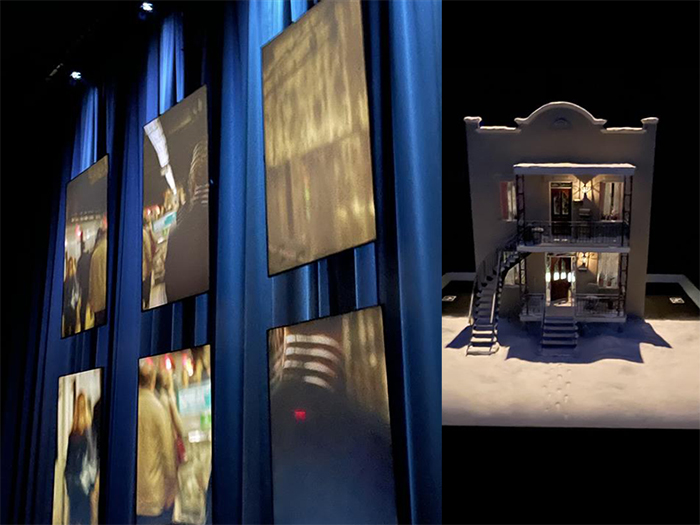
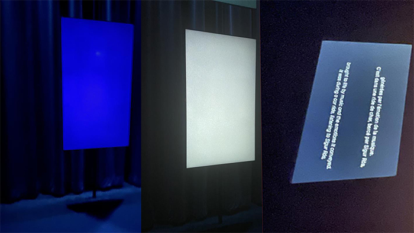
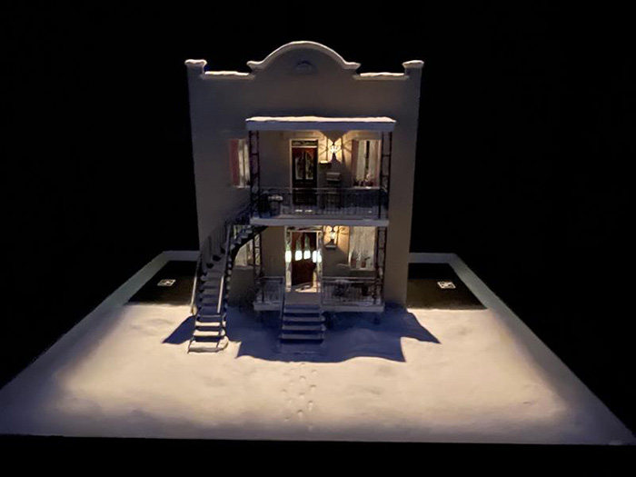
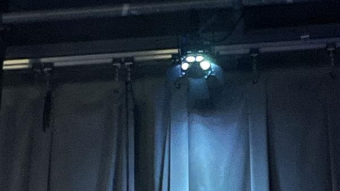
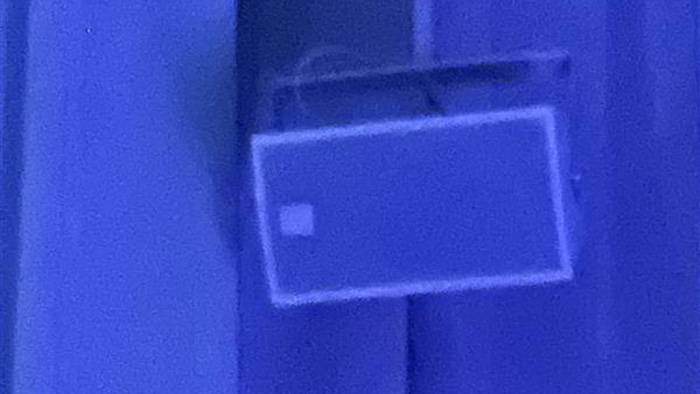
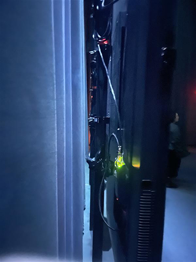

# Expo Jean-marc Vallé  
## Prélude
### Visite du 20 février 2025 au centre PHI (15 h 00)

*photo du centre PHI (internet)*

Le Centre Phi a ouvert ses portes en 2007 à Montréal. Il est un espace culturel situé à Montréal, au Canada, qui se distingue par sa programmation innovante dans les domaines de l'art, de la technologie et de la culture. Il propose une expérience immersive en offrant des expositions, des performances, des installations multimédia, des projections et des événements interactifs qui explorent les frontières entre l'art traditionnel et les nouvelles technologies.

Le Centre Phi met particulièrement l'accent sur l'innovation numérique et les projets immersifs, créant un dialogue entre l'art et les technologies émergentes telles que la réalité virtuelle, la réalité augmentée et les installations interactives. Il accueille des artistes locaux et internationaux, permettant au public de découvrir des œuvres avant-gardistes et de participer à des expériences culturelles uniques.

Avec son architecture moderne et ses installations de pointe, le Centre Phi est devenu un lieu incontournable pour les passionnés d'art contemporain, de culture numérique et d'expériences sensorielles.

 *Création exposition Jean-marc Vallé, en  en 2020 par centre PHI en collaboration avec :*
 - <ins>**Grand partenaire :</ins>** Québec
 - <ins>**Présenté par :</ins>** Hydro Québec
 - <ins>**Avec le soutien de :</ins>** Vieux montréal
 - <ins>**Partenaire média</ins> :** La press
 - <ins>**Partenaire de diffusion :</ins>** Cinéma Parc Musée

## ouevres
- **Prélude**
- **Courts métrages**
- **Les mixtapes**
- **Les voix**
 
 ## **Prélude**
  
 *photo prise par moi*
 
Prélude au Centre Phi est une introduction immersive à l'univers cinématographique de Jean-Marc Vallée, réalisée avant l'exposition principale qui lui est dédiée. Elle permet aux visiteurs de découvrir l'approche unique du réalisateur à travers des projections, des installations et des éléments interactifs.

Prélude met en lumière l'importance de la musique et des émotions dans ses films, tout en explorant ses méthodes de narration visuelle et sonore. L'exposition donne un aperçu de son processus créatif et de l'impact de son travail sur la culture cinématographique. C'est une manière de plonger progressivement dans l'univers de Jean-Marc Vallée, avant de vivre une expérience plus immersive et complète dans l'exposition principale qui lui est consacrée.

 
*photos prises par moi*

# **Dispositifs nécessaires**

Prélude nécessite plusieurs dispositifs pour offrir une immersion totale. En tant que projet intérieur résumant presque toute sa vie, Prélude occupe ainsi une salle entière qui lui est dédiée. Afin d'éviter les échos indésirables, il recouvre la pièce de rideaux, créant ainsi un environnement contrôlé. Un système sonore performant est également installé, avec des haut-parleurs placés stratégiquement dans toute la salle pour offrir un son à 360 degrés, renforçant l'effet d'immersion.

La salle est équipée de 13 écrans : six sur un côté, six de l'autre, et un petit dernier, où une maquette d’une jolie maison, représentant la sienne. Plusieurs câbles sont évidemment nécessaires pour alimenter les écrans, les haut-parleurs, ainsi que les lumières, qui sont également disposées un peu partout pour créer des jeux de couleurs en harmonie avec les séquences filmées projetées à l'écran.

### 13 écrans
 
 *fournis par Élément AI* 
 *photo prise par moi*

### Maquette maison
 
 *fournis par Élément Élément AI* 
 *photo prise par moi*

### Des lumieres
 
 *fournis par Ubisoft* 
 *photo prise par moi*

### Système de son
 
 *fournis par Centre des sciences* 
 *photo prise par moi*

### Cables
 
 *fournis par Centre des sciences* 
 *photo prise par moi*

## Appréciation

J'ai adoré l'exposition "Jean_Marc Vallé", notamment l'œuvre "Prélude". "Prélude" était très intéressante car nous étions vraiment entourés de plusieurs dispositifs, ce qui nous plongeait pleinement dans l'immersion. "Prélude" est super important car il nous prépare très bien à la suite de l'exposition. Cette étape, pour une personne qui ne connaissait pas l'œuvre de Jean-Marc Vallée, était très pertinente et m'a permis de mieux comprendre le reste de l'exposition.

