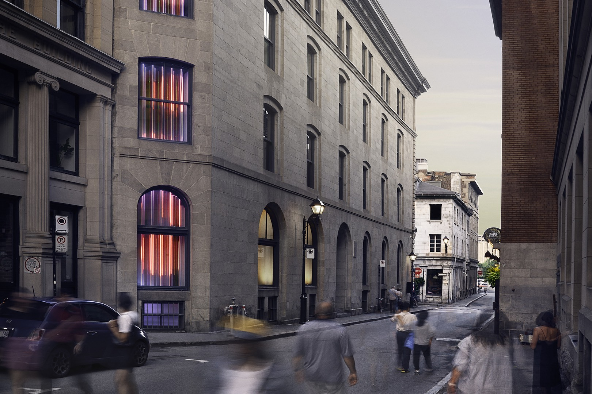
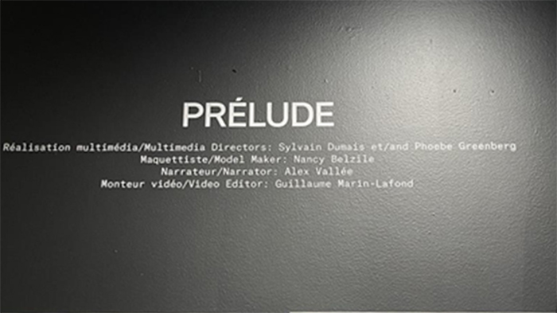

# Expo Jean-marc Vallé  
## Prélude
### Visite du 20 février 2025 au centre PHI (15 h 00)

*photo du centre PHI (internet)*

Le Centre Phi a ouvert ses portes en 2007 à Montréal. Il est un espace culturel situé à Montréal, au Canada, qui se distingue par sa programmation innovante dans les domaines de l'art, de la technologie et de la culture. Il propose une expérience immersive en offrant des expositions, des performances, des installations multimédia, des projections et des événements interactifs qui explorent les frontières entre l'art traditionnel et les nouvelles technologies.

Le Centre Phi met particulièrement l'accent sur l'innovation numérique et les projets immersifs, créant un dialogue entre l'art et les technologies émergentes telles que la réalité virtuelle, la réalité augmentée et les installations interactives. Il accueille des artistes locaux et internationaux, permettant au public de découvrir des œuvres avant-gardistes et de participer à des expériences culturelles uniques.

Avec son architecture moderne et ses installations de pointe, le Centre Phi est devenu un lieu incontournable pour les passionnés d'art contemporain, de culture numérique et d'expériences sensorielles.

 *Création exposition Jean-marc Vallé, en  en 2020 par centre PHI en collaboration avec :*
 - <ins>**Grand partenaire :</ins>** Québec
 - <ins>**Présenté par :</ins>** Hydro Québec
 - <ins>**Avec le soutien de :</ins>** Vieux montréal
 - <ins>**Partenaire média</ins> :** La press
 - <ins>**Partenaire de diffusion :</ins>** Cinéma Parc Musée

## ouevres
- **Prélude**
- **Courts métrages**
- **Les mixtapes**
- **Les voix**
 
 ## **Prélude**
  
 *photo prise par moi*
 
L'exposition Prélude au Centre Phi est une introduction immersive à l'univers cinématographique de Jean-Marc Vallée, réalisée avant l'exposition principale qui lui est dédiée. Elle permet aux visiteurs de découvrir l'approche unique du réalisateur à travers des projections, des installations et des éléments interactifs.

Prélude met en lumière l'importance de la musique et des émotions dans ses films, tout en explorant ses méthodes de narration visuelle et sonore. L'exposition donne un aperçu de son processus créatif et de l'impact de son travail sur la culture cinématographique. C'est une manière de plonger progressivement dans l'univers de Jean-Marc Vallée, avant de vivre une expérience plus immersive et complète dans l'exposition principale qui lui est consacrée.
 *photo prise par moi*

*explication en photo*

# **Dispositifs nécessaires**

Plusieurs dispositifs sont nécessaires pour le bon déroulement de l'activité interactive, notamment des caméras à haute, basse et normale fréquence, ainsi que de la lumière ultraviolette. Il faut également de grands écrans pour observer les résultats fascinants des effets produits par les fréquences. Des grosse boîte englobe touts les fils nécessaires et la technologie requise pour les écrans et caméras. *Aucune photo ne peux être prise à l'interrieur de la boite (tecnhologie à l'interrieur fournis par  Pratt & Whitney)*

### 13 écrans
*fournis par Élément AI*

 *photo prise par moi*

### Maquette maison
*fournis par Élément Élément AI*

 *photo prise par moi*

### Des lumieres
*fournis par Ubisoft*

 *photo prise par moi*

### Système de son
*fournis par Centre des sciences*

 *photo prise par moi*

### Cables
*fournis par Centre des sciences*

 *photo prise par moi*

## Intéractivité

Bien sûr, la partie interactive joue un rôle clé en engageant l'utilisateur à poser des actions, à réfléchir et à interagir activement avec le dispositif. Cette interaction stimule sa curiosité et l'incite à explorer les différentes facettes de l'expérience. En l'invitant à prendre des décisions et à expérimenter, l'utilisateur devient un acteur central du processus, rendant l'activité non seulement plus captivante, mais aussi plus enrichissante.

 *photo prise par moi*

 
Ici, deux questions permettent de comprendre ce que l'on peut observer avec les fréquences. Cela offre à l'utilisateur l'opportunité d'apprendre et de s'amuser en même temps, en explorant son propre corps pour répondre à ce qui lui est demandé.

## Appréciation

J'ai adoré l'exposition "Mixtape", notamment l'œuvre "Prélude". "Prélude" était très intéressante car nous étions vraiment entourés de plusieurs dispositifs, ce qui nous plongeait pleinement dans l'immersion. "Prélude" est super important car il nous prépare très bien à la suite de l'exposition. Cette étape, pour une personne qui ne connaissait pas l'œuvre de Jean-Marc Vallée, était très pertinente et m'a permis de mieux comprendre le reste de l'exposition.

*Si les technologies du Centre des sciences vous intéresse, allez les observer de vos propres yeux.*

https://www.centredessciencesdemontreal.com/

