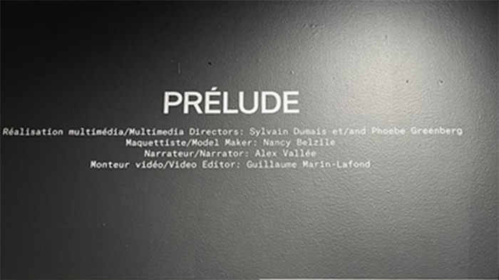
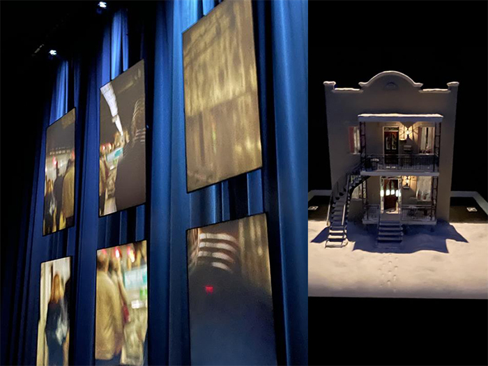
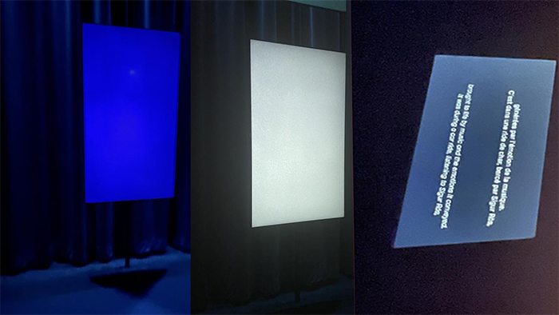
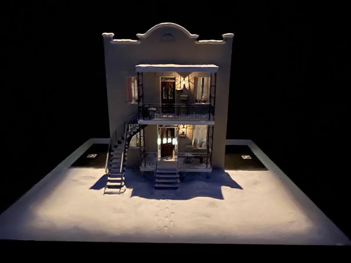
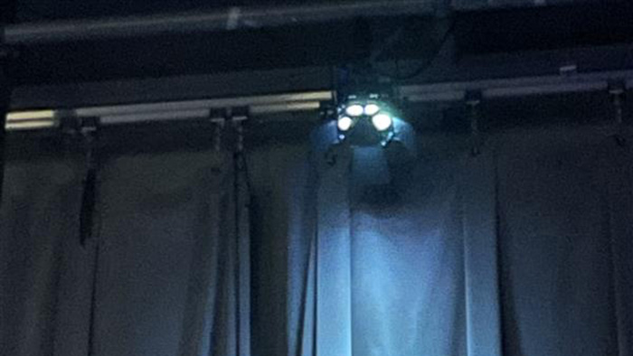
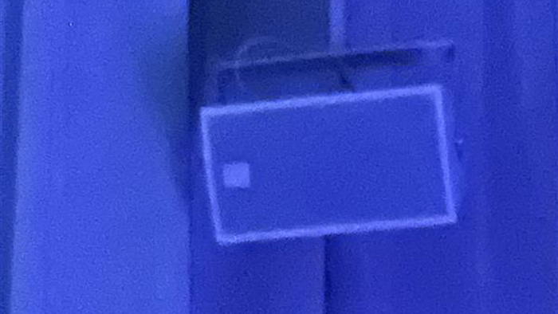
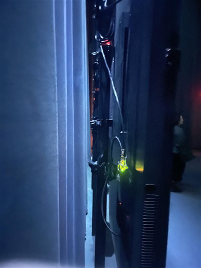

# Expo Jean-marc Vallé 

### Visite du 20 février 2025 au centre PHI (15 h 00)

Bonjour, je vais vous présenter ma visite au Centre PHI, que j’ai faite le 20 février 2025, pour aller voir l’exposition de Jean-Marc Vallée.
C’était une exposition qui regroupait plusieurs œuvres : Prélude, Mixtape, Courts-métrages et Les Voix.
Aujourd’hui, je vais vous parler plus précisément de l’œuvre Prélude.

## Prélude
Prélude au Centre Phi est une introduction immersive à l'univers cinématographique de Jean-Marc Vallée, réalisée avant l'exposition principale qui lui est dédiée. Elle permet aux visiteurs de découvrir l'approche unique du réalisateur à travers des projections, des installations et des éléments interactifs.Prélude met en lumière l'importance de la musique et des émotions dans ses films, tout en explorant ses méthodes de narration visuelle et sonore. L'exposition donne un aperçu de son processus créatif et de l'impact de son travail sur la culture cinématographique. C'est une manière de plonger progressivement dans l'univers de Jean-Marc Vallée, avant de vivre une expérience plus immersive et complète dans l'exposition principale qui lui est consacrée.En arrivant au Centre PHI, nous sommes accueillis par une dame qui nous fait un court aperçu de ce qui va se passer, puis nous emmène à l’étage pour commencer la visite, en débutant par Prélude, qui se trouve dans la première salle.

### Élément néscéssaire
La salle est équipée de 13 écrans : six sur un côté, six de l'autre, et un petit dernier, où une maquette d’une jolie maison, représentant la sienne. Plusieurs câbles sont évidemment nécessaires pour alimenter les écrans, les haut-parleurs, ainsi que les lumières, qui sont également disposées un peu partout pour créer des jeux de couleurs en harmonie avec les séquences filmées projetées à l'écran.

### Expérience vécue
Une fois à l’intérieur, tu es subjugé par tous les écrans disposés de chaque côté et par la qualité du son immersif.
Tu as vraiment l’impression d’être plongé au cœur du projet, et tu es automatiquement captivé par ce que tu vois et entends.
C’est donc une œuvre contemplative très réussie.

###  Appréciation
J’ai beaucoup aimé cette œuvre, car je ne connaissais pas Jean-Marc Vallée auparavant — et justement, cette œuvre est faite pour ça ! Grâce à Prélude, j’ai vraiment pu apprécier beaucoup plus le reste des œuvres, car je me sentais plus impliqué et j’avais désormais l’impression de connaître Jean-Marc Vallée et tous ses projets.
Je trouve que c’est une idée très brillante de créer une œuvre qui permet ensuite de faire rayonner les autres pièces de l’exposition.

### Liens

 
 ## **Prélude**
  
 *photo prise par moi*
 

 
*photos prises par moi*

# **Dispositifs nécessaires**

Prélude nécessite plusieurs dispositifs pour offrir une immersion totale. En tant que projet intérieur résumant presque toute sa vie, Prélude occupe ainsi une salle entière qui lui est dédiée. Afin d'éviter les échos indésirables, il recouvre la pièce de rideaux, créant ainsi un environnement contrôlé. Un système sonore performant est également installé, avec des haut-parleurs placés stratégiquement dans toute la salle pour offrir un son à 360 degrés, renforçant l'effet d'immersion.

La salle est équipée de 13 écrans : six sur un côté, six de l'autre, et un petit dernier, où une maquette d’une jolie maison, représentant la sienne. Plusieurs câbles sont évidemment nécessaires pour alimenter les écrans, les haut-parleurs, ainsi que les lumières, qui sont également disposées un peu partout pour créer des jeux de couleurs en harmonie avec les séquences filmées projetées à l'écran.

### 13 écrans
 
 *fournis par Élément AI* 
 *photo prise par moi*

### Maquette maison
 
 *fournis par Élément Élément AI* 
 *photo prise par moi*

### Des lumieres
 
 *fournis par Ubisoft* 
 *photo prise par moi*

### Système de son
 
 *fournis par Centre des sciences* 
 *photo prise par moi*

### Cables
 
 *fournis par Centre des sciences* 
 *photo prise par moi*

## Appréciation

J'ai adoré l'exposition "Jean_Marc Vallé", notamment l'œuvre "Prélude". "Prélude" était très intéressante car nous étions vraiment entourés de plusieurs dispositifs, ce qui nous plongeait pleinement dans l'immersion. "Prélude" est super important car il nous prépare très bien à la suite de l'exposition. Cette étape, pour une personne qui ne connaissait pas l'œuvre de Jean-Marc Vallée, était très pertinente et m'a permis de mieux comprendre le reste de l'exposition.

*Si cette exposition vous intéresse, réservez rapidement votre place pour la prochaine démonstration.* 
https://phi.ca/fr/evenements/jean-marc-vallee-mixtape/

### Source photos 
- centre phi : https://phi.ca/uploads/_1200x800_crop_center-center_100_line_ns/PHI_Event_Centre_MyriadeChromatique_IMG3_Credit-Sylvain-Dumais.jpg

