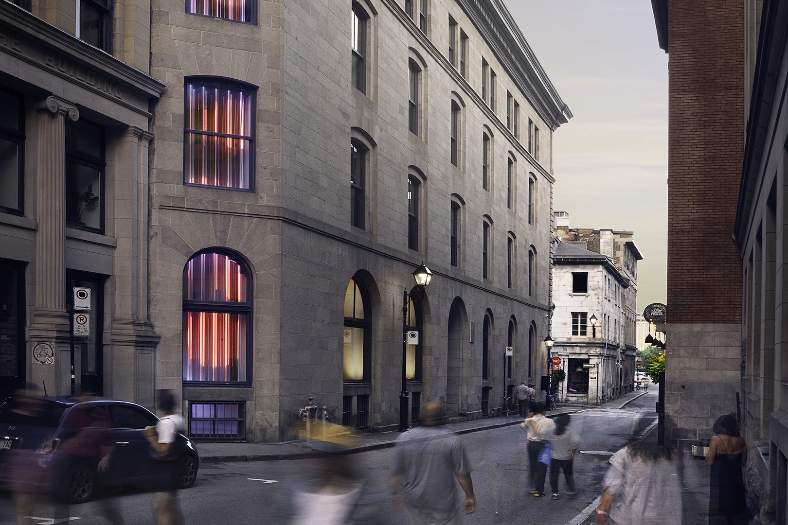

# Expo Jean-marc Vallé 

### Visite du 20 février 2025 au centre PHI (15 h 00)

Bonjour, je vais vous présenter ma visite au Centre PHI, que j’ai faite le 20 février 2025, pour aller voir l’exposition de Jean-Marc Vallée.
C’était une exposition qui regroupait plusieurs œuvres : Prélude, Mixtape, Courts-métrages et Les Voix.
Aujourd’hui, je vais vous parler plus précisément de l’œuvre Prélude.

## Prélude
Prélude au Centre Phi est une introduction immersive à l'univers cinématographique de Jean-Marc Vallée, réalisée avant l'exposition principale qui lui est dédiée. Elle permet aux visiteurs de découvrir l'approche unique du réalisateur à travers des projections, des installations et des éléments interactifs.Prélude met en lumière l'importance de la musique et des émotions dans ses films, tout en explorant ses méthodes de narration visuelle et sonore. L'exposition donne un aperçu de son processus créatif et de l'impact de son travail sur la culture cinématographique. C'est une manière de plonger progressivement dans l'univers de Jean-Marc Vallée, avant de vivre une expérience plus immersive et complète dans l'exposition principale qui lui est consacrée.En arrivant au Centre PHI, nous sommes accueillis par une dame qui nous fait un court aperçu de ce qui va se passer, puis nous emmène à l’étage pour commencer la visite, en débutant par Prélude, qui se trouve dans la première salle.

### Élément néscéssaire
La salle est équipée de 13 écrans : six sur un côté, six de l'autre, et un petit dernier, où une maquette d’une jolie maison, représentant la sienne. Plusieurs câbles sont évidemment nécessaires pour alimenter les écrans, les haut-parleurs, ainsi que les lumières, qui sont également disposées un peu partout pour créer des jeux de couleurs en harmonie avec les séquences filmées projetées à l'écran.

### Expérience vécue
Une fois à l’intérieur, tu es subjugé par tous les écrans disposés de chaque côté et par la qualité du son immersif.
Tu as vraiment l’impression d’être plongé au cœur du projet, et tu es automatiquement captivé par ce que tu vois et entends.
C’est donc une œuvre contemplative très réussie.

###  Appréciation
J’ai beaucoup aimé cette œuvre, car je ne connaissais pas Jean-Marc Vallée auparavant — et justement, cette œuvre est faite pour ça ! Grâce à Prélude, j’ai vraiment pu apprécier beaucoup plus le reste des œuvres, car je me sentais plus impliqué et j’avais désormais l’impression de connaître Jean-Marc Vallée et tous ses projets.
Je trouve que c’est une idée très brillante de créer une œuvre qui permet ensuite de faire rayonner les autres pièces de l’exposition.

### Liens
Prélude m’a beaucoup fait penser à l’œuvre Anri-Sala au Musée des beaux-arts. Les deux étaient présentées dans une grande salle, un peu dans le style d’une salle de cinéma, avec des écrans.
Par contre, pour moi, Prélude est beaucoup plus réussie, car l’utilisation de l’espace était parfaite. Il n’y avait aucun vide, et peu importe où l’on regardait, il y avait du contenu qui se poursuivait de façon cohérente.
Sans oublier que le contenu lui-même était très intéressant.
À part l'oeuvre Anri-sala, Prélude était très différente de tout ce que j’ai vu cette session, et c’est probablement l’œuvre la plus immersive que j’ai vue jusqu’à maintenant.

### Conclusion
Prélude est donc une œuvre très efficace dans le cadre de cette exposition, car grâce à tous ses éléments, elle permet de vivre un véritable moment immersif tout en nous préparant pour la suite.
Pour ma part, Prélude m’a donné de l’inspiration pour l’avenir. Je vais certainement garder en tête l’idée de créer une œuvre qui sert d’introduction au reste d’une exposition, et qui rend les autres œuvres encore plus pertinentes grâce à cette mise en contexte initiale.

