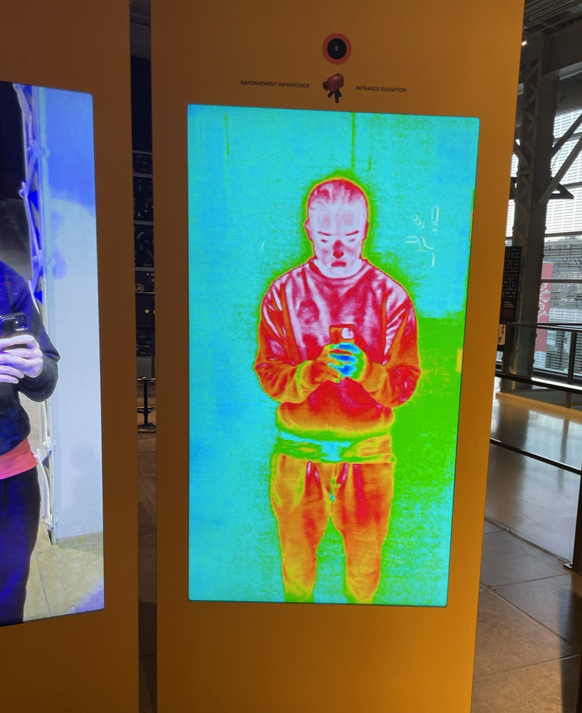
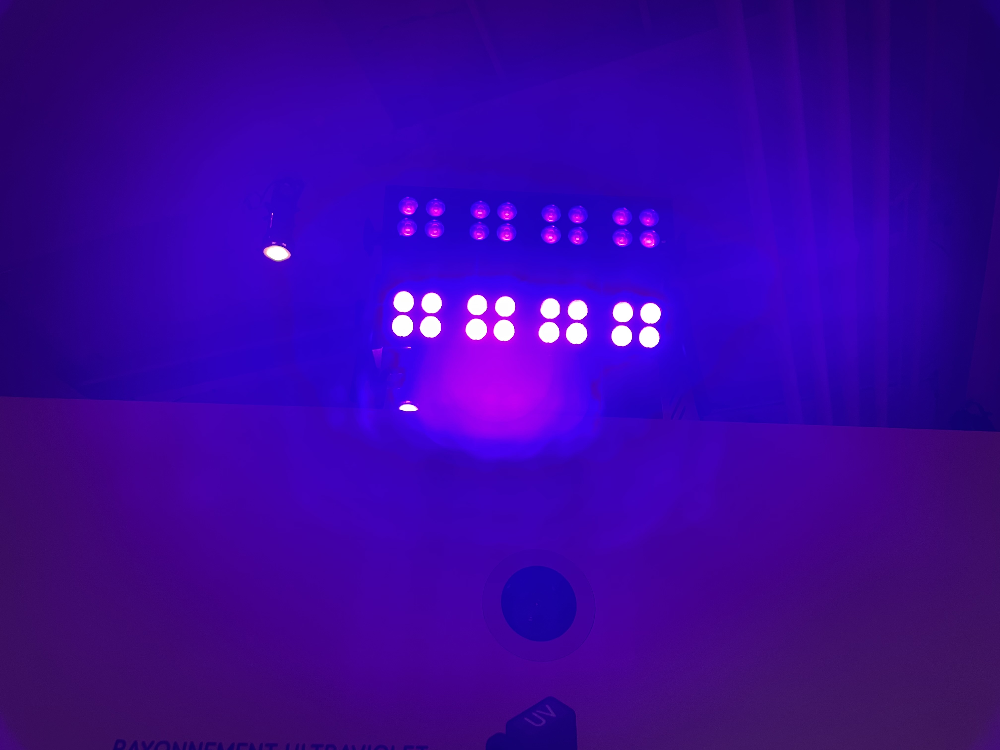
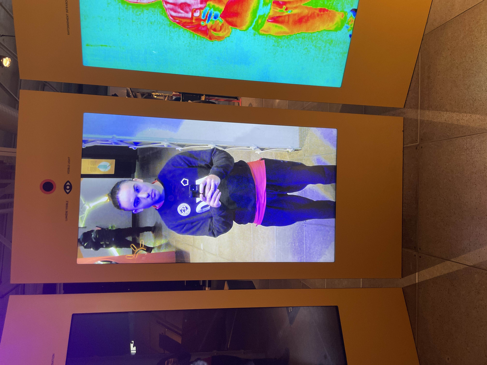
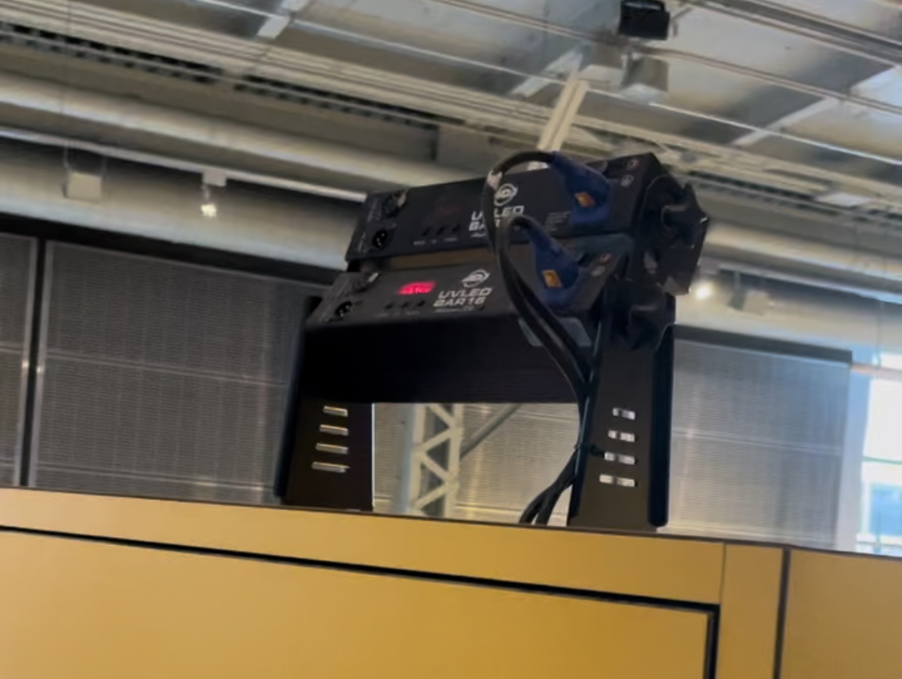
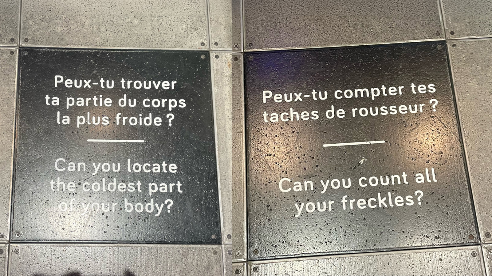

# Expo centre des sciences
.jpg)
*photo du batiment*

## **Explore, caméra à fréquence**  
Le Centre des Sciences de Montréal est un lieu fascinant où les visiteurs peuvent plonger dans l’univers de la science à travers des expositions interactives et des technologies innovantes. L'une des expériences les plus captivantes de cet endroit est l'exploration des caméras de fréquence, des dispositifs qui captent des phénomènes invisibles à l'œil nu. 

 
 *texte sur le monde invisible*
 
 ## **Caméra fréquence**
 Les caméras de fréquence sont des outils puissants qui permettent d'analyser et de visualiser des ondes électromagnétiques, sonores, et même des fréquences lumineuses dans des spectres au-delà de ce que nous pouvons percevoir. En explorant ces technologies, les visiteurs peuvent découvrir comment des phénomènes comme les ondes radio, les infrasons ou les ultrasons affectent notre quotidien sans que nous en soyons conscients.
 

*explication en photo*

## **Démonstration interactive**
À travers des démonstrations interactives, les médiateurs du Centre des Sciences offrent une occasion unique de comprendre la complexité de ces fréquences. Par exemple, les caméras de fréquence peuvent être utilisées pour observer comment la lumière infrarouge est utilisée dans les équipements de vision nocturne ou comment les ondes sonores peuvent être captées et transformées en informations utiles.
Les visiteurs sont invités à tester eux-mêmes ces caméras, en découvrant comment elles peuvent capturer des fréquences invisibles, souvent utilisées dans les technologies modernes, les phénomènes naturels comme les orages par exemple.

*moi en haute fréquence*

*moi en basse fréquence*

# **Dispositif néscésaire**

Plusieurs dispositifs sont nécessaires pour le bon déroulement de l'activité interactive, notamment des caméras à haute, basse et normale fréquence, ainsi que de la lumière ultraviolette. Il faut également de grands écrans pour observer les résultats fascinants des effets produits par les fréquences. Des grosse boîte englobe touts les fils nécessaires et la technologie requise pour les écrans et caméras.

### Caméras haute/ basse/ normal fréquence

### Lumière ultra violette

### Gros écrans

### Des fils

## Intéractivité

Bien sûr, la partie interactive joue un rôle clé en engageant l'utilisateur à poser des actions, à réfléchir et à interagir activement avec le dispositif. Cette interaction stimule sa curiosité et l'incite à explorer les différentes facettes de l'expérience. En l'invitant à prendre des décisions et à expérimenter, l'utilisateur devient un acteur central du processus, rendant l'activité non seulement plus captivante, mais aussi plus enrichissante.

Ici, deux questions permettent de comprendre ce que l'on peut observer avec les fréquences. Cela offre à l'utilisateur l'opportunité d'apprendre et de s'amuser en même temps, en explorant son propre corps pour répondre à ce qui lui est demandé.

Si les technologies du Centre des sciences vous ont plu, allez les observer de vos propres yeux.

https://www.centredessciencesdemontreal.com/

