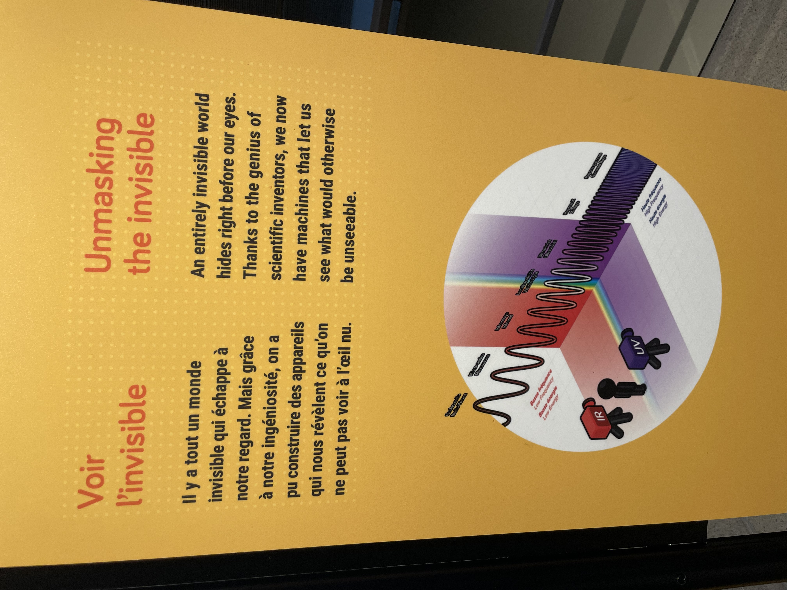
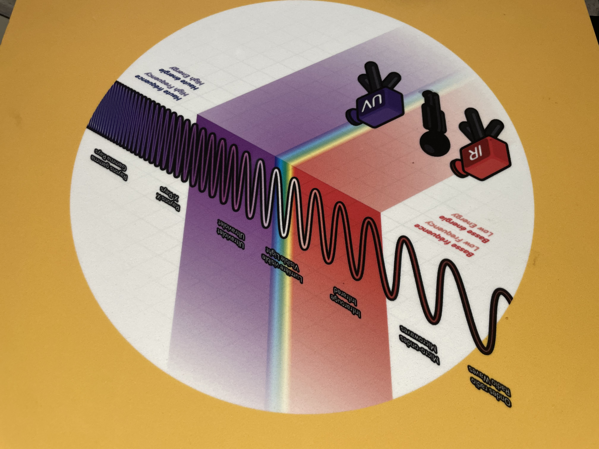

# Expo centre des sciences
.jpg)
*photo du batiment*

## **Explore, caméra à fréquence**  
Le Centre des Sciences de Montréal est un lieu fascinant où les visiteurs peuvent plonger dans l’univers de la science à travers des expositions interactives et des technologies innovantes. L'une des expériences les plus captivantes de cet endroit est l'exploration des caméras de fréquence, des dispositifs qui captent des phénomènes invisibles à l'œil nu. 

 
 *texte sur le monde invisible*
 
 ## **Caméra fréquence**
 Les caméras de fréquence sont des outils puissants qui permettent d'analyser et de visualiser des ondes électromagnétiques, sonores, et même des fréquences lumineuses dans des spectres au-delà de ce que nous pouvons percevoir. En explorant ces technologies, les visiteurs peuvent découvrir comment des phénomènes comme les ondes radio, les infrasons ou les ultrasons affectent notre quotidien sans que nous en soyons conscients.
 

lien sur le "stop motion" https://www.stopmotionstudio.com/

## Ce qui me plait dans l'introduction à la muséologie en TIM
Apprendre et découvrir des sujets et des expositions que je ne connaissais pas, qui pourraient approfondir mes connaissances dans ce nouveau domaine qu'est le multimédia.
