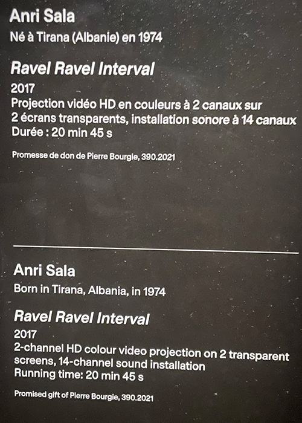
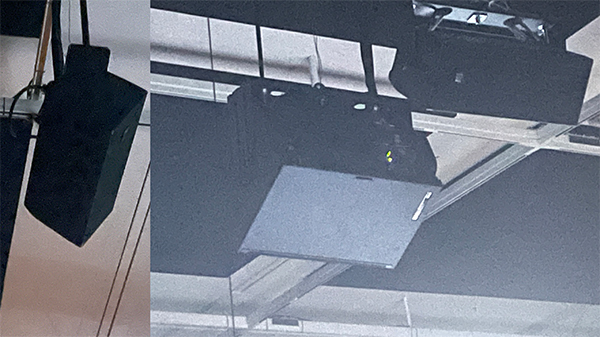
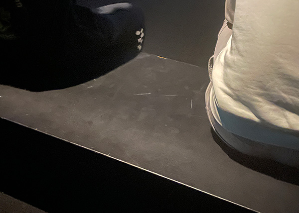
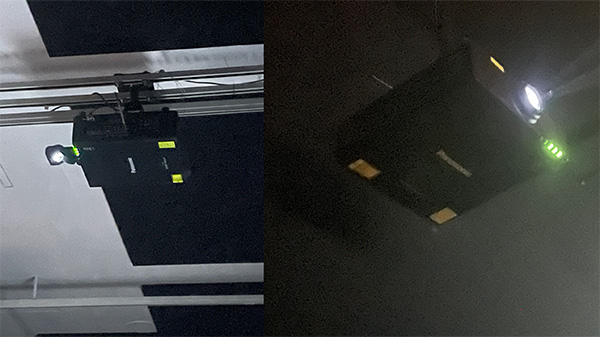

# Musée des beaux-arts de Montréal
## Exposition Anri Sala
 
*Photo du  Musée des beaux-arts de Montréal* (`internet`)
## Ravel Ravel Interval

L’œuvre Ravel Ravel Interval propose une exploration originale du rythme, du temps et de la répétition. À travers une mise en scène sonore et visuelle, elle interroge notre perception de l’écoute et du mouvement. Inspirée par la musique de Maurice Ravel, cette création joue sur les décalages et les superpositions, créant une expérience à la fois immersive et contemplative.

### Petit texte photo sur l’œuvre Ravel Ravel Interval
 
*Photo prise par moi*

En entrant dans la pièce, on découvre deux écrans séparés par quelques mètres, ce qui nous plonge immédiatement dans le questionnement face à cette œuvre contemplative. Une fois assis sur le banc, en face de l'installation, on remarque que les écrans sont légèrement transparents. Cela crée un effet de profondeur surprenant, donnant une dimension particulière à l’image de l’homme jouant du piano.
### Vue à l'entrée
 
*Photo prise par moi*

### Vue de face
 
*Photo prise par moi*

## Éléments nécessaires à la mise en exposition
 
*Photo prise par moi*

Plusieurs éléments sont nécessaires pour réaliser cette œuvre. Tout d’abord, il faut une grande salle, car Ravel Ravel Interval occupe beaucoup d’espace. L’installation demande deux écrans ou toiles, placés à quelques mètres l’un de l’autre, afin de créer l’effet de profondeur. Deux projecteurs sont utilisés pour projeter sur chacun des écrans, et quatorze haut-parleurs sont répartis dans la pièce pour créer un environnement sonore immersif.

Deux bancs sont également placés à une distance idéale des écrans, permettant aux spectateurs de s’asseoir confortablement tout en observant l’œuvre sans se fatiguer les yeux. Enfin, de petites lumières tamisées apportent une atmosphère apaisante à la salle, favorisant la contemplation.

### Hauts parleurs
 
*Photo prise par moi*

### Écrans
 
*Photo prise par moi*

### Bancs
 
*Photo prise par moi*

### Lumières
 
*Photo prise par moi*

### Projecteurs
 
*Photo prise par moi*

