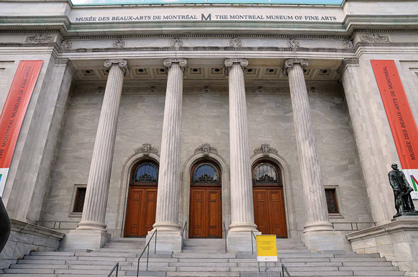
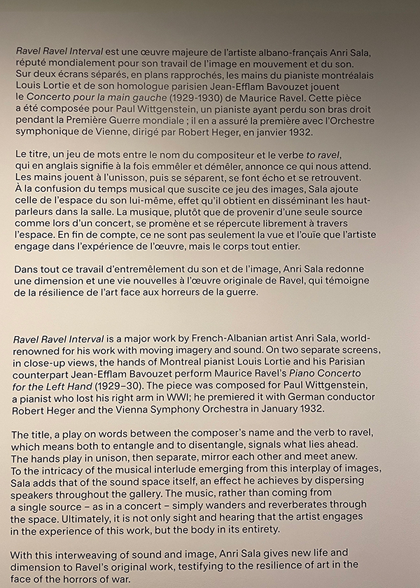

# Musée des beaux-arts de Montréal
## Exposition Anri Sala
 
*Photo du  Musée des beaux-arts de Montréal* (`internet`)
## Ravel Ravel Interval

L’œuvre Ravel Ravel Interval propose une exploration originale du rythme, du temps et de la répétition. À travers une mise en scène sonore et visuelle, elle interroge notre perception de l’écoute et du mouvement. Inspirée par la musique de Maurice Ravel, cette création joue sur les décalages et les superpositions, créant une expérience à la fois immersive et troublante.

### Petit texte photo sur l’œuvre Ravel Ravel Interval
 
*Photo prise par moi*

