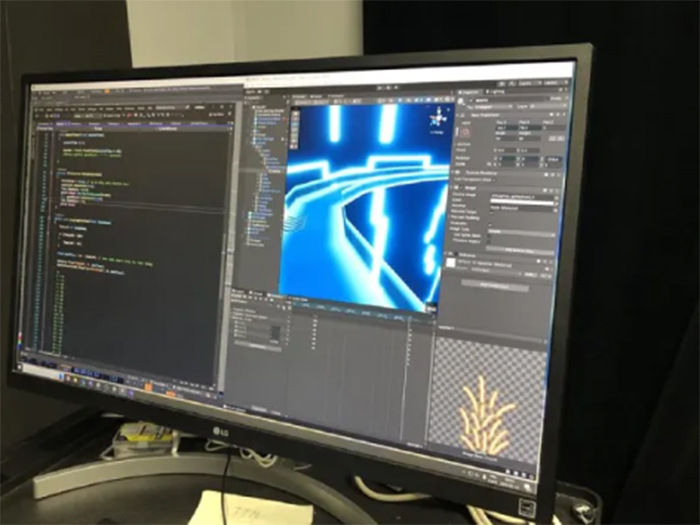
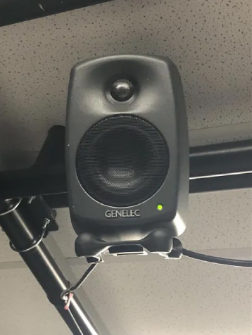
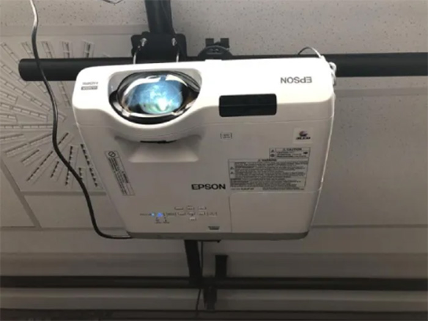
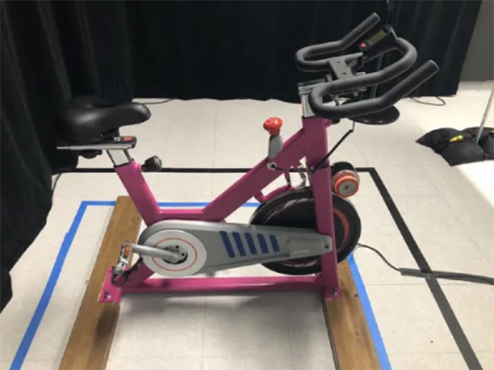
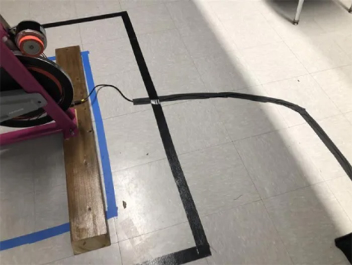
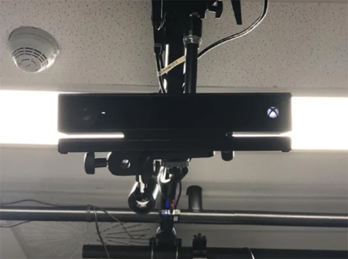
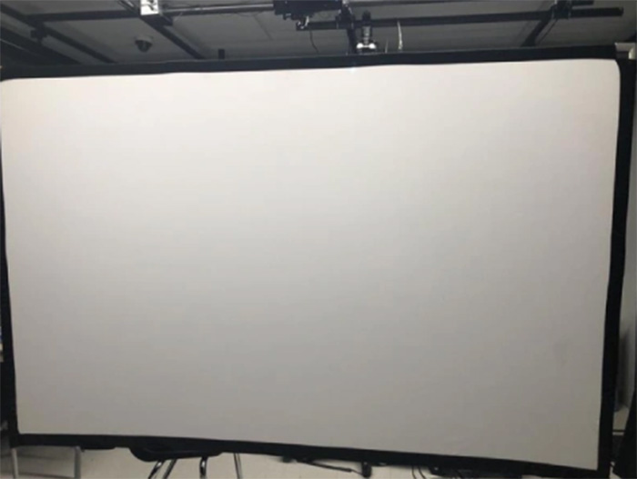
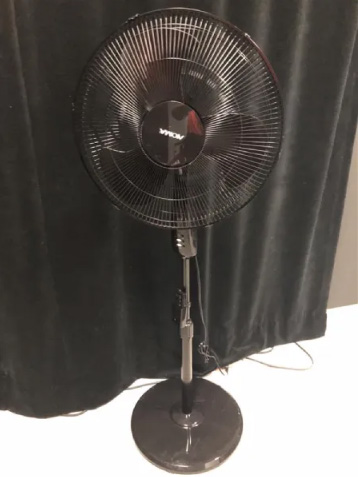

# Expo Resonnance

Visite du mardi 19 mars 2025
### 
*affiche fait par resonance*

### 
## Équipe
- <ins>**Ian Corbin</ins> :** créateur du circuit
- <ins>**Samuel Desmeules Voyer</ins> :** directeur artistique et artiste 3D en chef
- <ins>**Alexandre Gervais</ins> :** programmeur des méchaniques
- <ins>**Kevin Malric</ins> :** responsable des média vidéo, responsable du déploiement technique
- <ins>**Jérémy Roy Coté</ins> :** programmeur d'interconnectivité

 
Condu8 est un jeu interactif qui pousse l'utilisateur à faire du sport. En effet, dans ce jeu, l'utilisateur incarne un motard et tente de vaincre ses adversaires. Dans la vraie vie, il est sur un vélo stationnaire et tous ses mouvements sont captés par une Kinect pour contrôler le motard dans le jeu. L'utilisateur pédale donc et bouge de droite à gauche pour tenter de gagner la partie. Une vraie partie de plaisir tout en faisant du sport.  

### Fiche
  
 *photo prise par Cyrine Ghiat*

 
 ## **Informations supplémentaires**
Condu8 a lieu au studio Tim, au Cégep Montmorency, dans le cadre de l'exposition Résonance. C'est une exposition temporaire qui se déroule du 17 au 21 mars. Condu8 est un dispositif très amusant et simple, car il ne prend pas beaucoup de place. En effet, il nécessite seulement un vélo, un écran juste en face, et un chariot contenant tout le matériel nécessaire, qui sera décrit plus bas. À moins d'avoir une toile extérieure, Condu8 est un dispositif qui peut seulement être installé à l'intérieur. Voici quelques photos pour nous montrer ce dispositif qui est à la fois immersif et interactif.

 ### Démo
 
*photos prises par Condu8*

### Mise en espace
 
*photo prise par Condu8*

# **matériaux nécessaires**

Malgré que Condu8 ne prenne pas beaucoup d'espace, il a besoin de nombreux matériaux pour fonctionner. Voici les matériaux nécessaires à son bon fonctionnement.

### Ordinateur
 
 *photo prise par Condu8*

 Fournie par le Cégep, l'ordinateur permet au dispositif de fonctionner et de créer toutes ses composantes, comme le son ou le visuel, à l'aide de logiciels tels que Unity, Visual Studio, Maya, Blender, TouchDesigner, Arduino et Reaper.

### Hauts parleurs
 
 *photo prise par Condu8*

 Fournis par le Cégep, les haut-parleurs permettent de diffuser le son dans la salle.

### Projecteur
 
 *photo prise par Condu8*

 Fournie par le Cégep, le projecteur permet de diffuser le visuel sur la toile.

### Vélo
 
 *photo prise par Condu8*

Fournie par le Cégep, le vélo est l'outil qui permet de faire du sport et de rendre l'expérience réaliste tout en permettant au jeu de capter ses mouvements.
### Cable Management
 
 *photo prise par Condu8*

 Fournis par le Cégep, les câbles servent à alimenter les haut-parleurs.

 ### Kinect
 
 *photo prise par Condu8*

Fournie par un des membres de l'équipe, la Kinect sert à capter les mouvements de l'utilisateur.

  ### Surface de projection
 
  *photo prise par Condu8*

Fournie par le Cégep, la toile sert à recevoir la lumière envoyée par le projecteur.

  ### Ventilateur
 
  *photo prise par Condu8*

Fournie par un des membres de l'équipe, le ventilateur sert à rafraîchir l'utilisateur qui risque d'avoir très chaud lors de son effort physique.

## Intéractivité

L'utilisateur voit un vélo et un écran. Il est donc poussé à monter sur le vélo et débuter le jeu. Une fois le jeu commencé, l'utilisateur pédale tout en regardant la toile pour jouer au jeu. L'utilisateur pédale le plus vite qu'il peut pour tenter de finir la course en première place !

 *photo prise par moi*

 
Ici, deux questions permettent de comprendre ce que l'on peut observer avec les fréquences. Cela offre à l'utilisateur l'opportunité d'apprendre et de s'amuser en même temps, en explorant son propre corps pour répondre à ce qui lui est demandé.

## Appréciation

J'adore le concept ! Je suis un grand sportif, donc forcément, pour moi, le fait d'avoir intégré du sport dans cette exposition marque énormément de points. Il est super important de faire du sport, et peut-être que pour certaines personnes, cette manière d'en faire les aidera à trouver la motivation nécessaire. Très belle idée, je conseille cette exposition à toute personne aimant faire du sport ou à toute personne cherchant des moyens de se motiver à en faire.

*Voici les autres projets super intéressants de l'exposition Résonance.*

https://tim-montmorency.com/2025/#/

