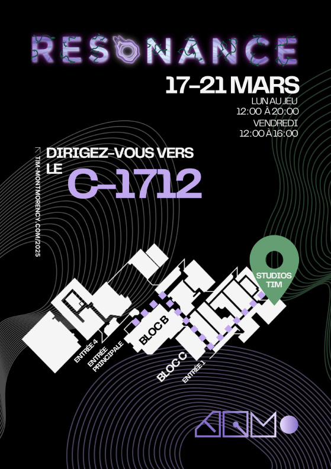

# Expo Resonnance

Visite du mardi 19 mars 2025
###  
*affiche resonance fait par resonance*

# 
## Équipe
- <ins>**Ian Corbin</ins> :** créateur du circuit
- <ins>**Samuel Desmeules Voyer</ins> :** directeur artistique et artiste 3D en chef
- <ins>**Alexandre Gervais</ins> :** programmeur des méchaniques
- <ins>**Kevin Malric</ins> :** responsable des média vidéo, responsable du déploiement technique
- <ins>**Jérémy Roy Coté</ins> :** programmeur d'interconnectivité

 
Le Centre des Sciences de Montréal est un lieu fascinant où les visiteurs peuvent plonger dans l’univers de la science à travers des expositions interactives et des technologies innovantes. L'une des expériences les plus captivantes de cet endroit est l'exploration des caméras de fréquence, des dispositifs qui captent des phénomènes invisibles à l'œil nu. Étant à la fois une installation contemplative et interactive, qui malgrés sa complexitée ne prend pas beaucoup de place dans l'établissement.  

*photo prise par moi*
 
 *texte sur le monde invisible*

 
 ## **Caméra fréquence**
 Les caméras de fréquence sont des outils puissants qui permettent d'analyser et de visualiser des ondes électromagnétiques, sonores, et même des fréquences lumineuses dans des spectres au-delà de ce que nous pouvons percevoir. En explorant ces technologies, les visiteurs peuvent découvrir comment des phénomènes comme les ondes radio, les infrasons ou les ultrasons affectent notre quotidien sans que nous en soyons conscients.

 *photo prise par moi*

*explication en photo*

## **Démonstration interactive**
À travers des démonstrations interactives, les médiateurs du Centre des Sciences offrent une occasion unique de comprendre la complexité de ces fréquences. Par exemple, les caméras de fréquence peuvent être utilisées pour observer comment la lumière infrarouge est utilisée dans les équipements de vision nocturne ou comment les ondes sonores peuvent être captées et transformées en informations utiles.
Les visiteurs sont invités à tester eux-mêmes ces caméras, en découvrant comment elles peuvent capturer des fréquences invisibles, souvent utilisées dans les technologies modernes, les phénomènes naturels comme les orages par exemple.

 *photo prise par moi*

*moi en haute fréquence*

 *photo prise par moi*

*moi en basse fréquence*

# **Dispositifs nécessaires**

Plusieurs dispositifs sont nécessaires pour le bon déroulement de l'activité interactive, notamment des caméras à haute, basse et normale fréquence, ainsi que de la lumière ultraviolette. Il faut également de grands écrans pour observer les résultats fascinants des effets produits par les fréquences. Des grosse boîte englobe touts les fils nécessaires et la technologie requise pour les écrans et caméras. *Aucune photo ne peux être prise à l'interrieur de la boite (tecnhologie à l'interrieur fournis par  Pratt & Whitney)*

### Ordinateur
*fournis par Élément AI*

 *photo prise par moi*

### Hauts parleurs
*fournis par Élément Élément AI*

 *photo prise par moi*

### Projecteur
*fournis par Ubisoft*

 *photo prise par moi*

### Vélo
*fournis par Centre des sciences*

 *photo prise par moi*

### Cable Management
*fournis par Centre des sciences*

 *photo prise par moi*

 ### Kinect
*fournis par Centre des sciences*

 *photo prise par moi*

  ### Surface de projection
*fournis par Centre des sciences*

 *photo prise par moi*

  ### Ventilateur
*fournis par Centre des sciences*

 *photo prise par moi*

## Intéractivité

Bien sûr, la partie interactive joue un rôle clé en engageant l'utilisateur à poser des actions, à réfléchir et à interagir activement avec le dispositif. Cette interaction stimule sa curiosité et l'incite à explorer les différentes facettes de l'expérience. En l'invitant à prendre des décisions et à expérimenter, l'utilisateur devient un acteur central du processus, rendant l'activité non seulement plus captivante, mais aussi plus enrichissante.

 *photo prise par moi*

 
Ici, deux questions permettent de comprendre ce que l'on peut observer avec les fréquences. Cela offre à l'utilisateur l'opportunité d'apprendre et de s'amuser en même temps, en explorant son propre corps pour répondre à ce qui lui est demandé.

## Appréciation

J'adore le concept ! Je suis un grand sportif, donc forcément, pour moi, le fait d'avoir intégré du sport dans cette exposition marque énormément de points. Il est super important de faire du sport, et peut-être que pour certaines personnes, cette manière d'en faire les aidera à trouver la motivation nécessaire. Très belle idée, je conseille cette exposition à toute personne aimant faire du sport ou à toute personne cherchant des moyens de se motiver à en faire.

*Voici les autres projets super intéressants de l'exposition Résonance.*

https://tim-montmorency.com/2025/#/

