# 
## Équipe
- <ins>**Vincent Delisle</ins> :** Développeur interactif et concepteur sonore
- <ins>**Ikrame Rata</ins> :** Chargée de projet
- <ins>**Jérémy Duverseau</ins> :** Directeur artistique
## l'installation en cours (ou finale)
Prismatica est présentement en cours. Voici quelques photos pour vous montrer visuellement Prismatica ainsi que sa fiche explicative.
### Fiche
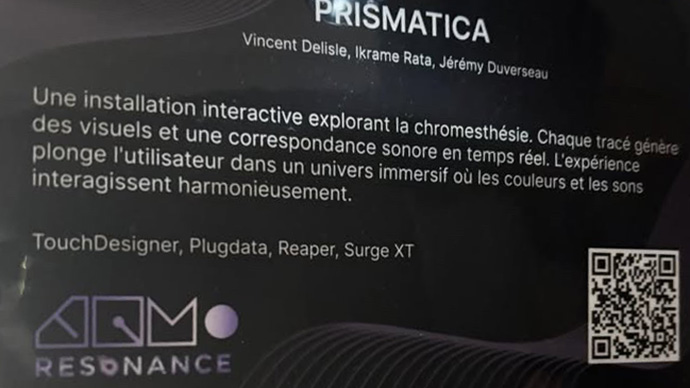 
*photo prise par Cyrine Ghiat*

### Photos à l'appui
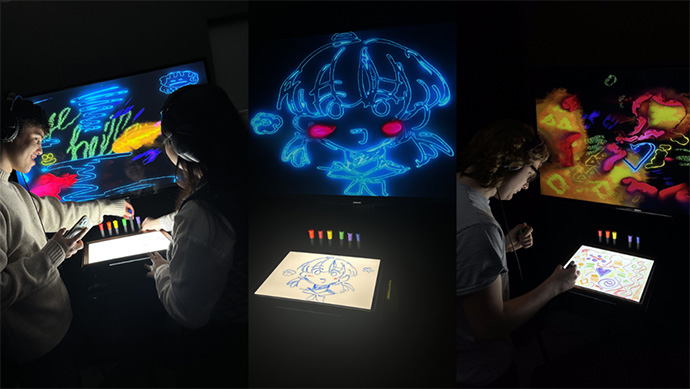 
*photos prises par Prismatica*
## schéma de l'installation prévue
Voici le schéma réalisé par Prismatica, nous montrant différent point de vu ainsi que le cable pour le projecteur.

### Vue - enssemble
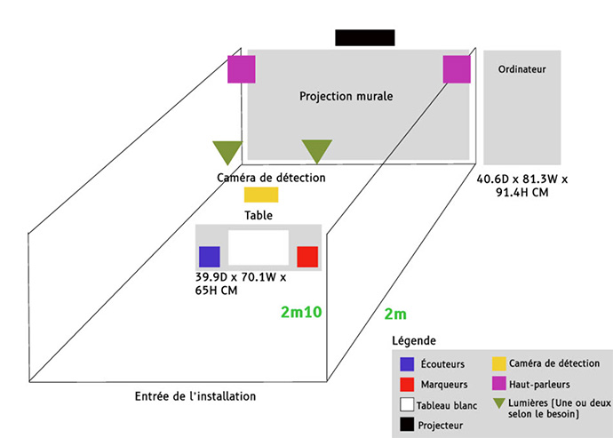 
*Schéma fait par Prismatica*

### Vue - proche
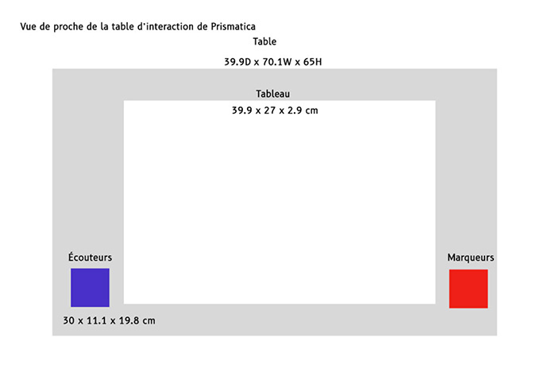 
*Schéma fait par Prismatica*

### Vue - haut
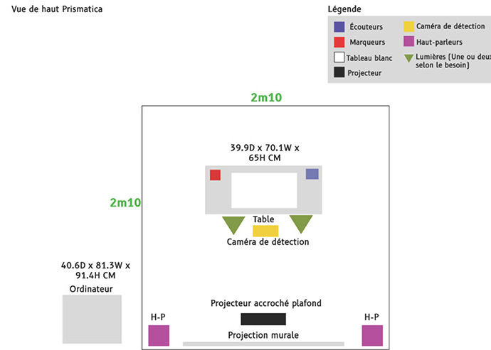 
*Schéma fait par Prismatica*

### Plantation cable
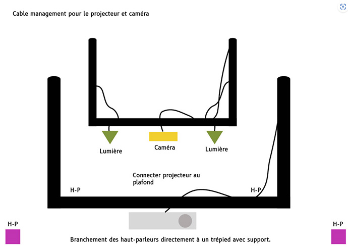 
*Schéma fait par Prismatica*

<ins>Source :</ins>https://pootpookies.github.io/Prismatica/#/30_production/60_plantation/
## ressenti
### Positif
C'est très spécial de pouvoir entendre des couleurs. C'est quelque chose que je n'aurais jamais imaginé, car je n'avais jamais pensé à l'idée que des couleurs pourraient avoir du son.
### Négatif
J'aime un peu moins le fait de mettre un casque, car je sens que je suis plus isolé. J'aurais préféré personnellement que tout le monde puisse voir et entendre ce que l'on fait.
### Recommandation
Je recommande Prismatica à toutes les personnes qui aiment tester de nouvelles choses qu'elles n'auraient jamais imaginé essayer.

#  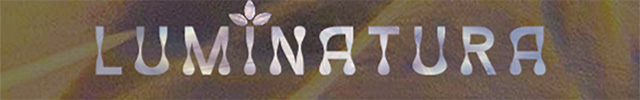
## Équipe
- <ins>**Audrey Dandurant</ins> :** Directrice audio visuel, Gestionnaire de projet
- <ins>**Camilia Bouatmani</ins> :** Directrice artistique
- <ins>**Ihab Mouhajer</ins> :** Développeur interactif
- <ins>**Justine Rousseau</ins> :** Programmeuse, Coordonatrice des médias
- <ins>**Prethiah Rajaratnam</ins> :** Administratrice du projet
## l'installation en cours (ou finale)
Luminatura est présentement finalisée. Voici quelques photos pour vous montrer visuellement Luminatura ainsi que sa fiche explicative.
### Fiche
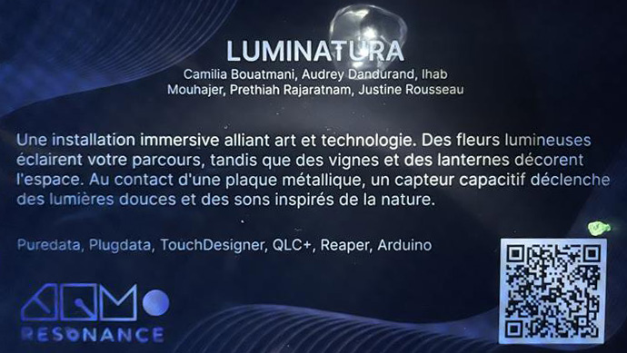 
*photo prise par moi*

### Photos à l'appui
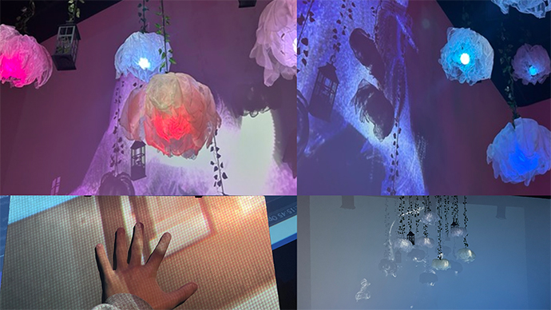 
*photos du haut prise par Luminatura* 
*photos du bas prise par moi*
## schéma de l'installation prévue
Voici le schéma réalisé par Luminatura, nous montrant la structure de base prévue par l'équipe ainsi que le schéma du studio prévu.
### structure de base
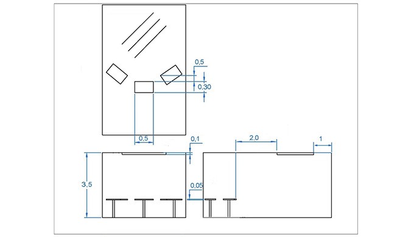 
*schéma fait par Luminatura*

### Studio
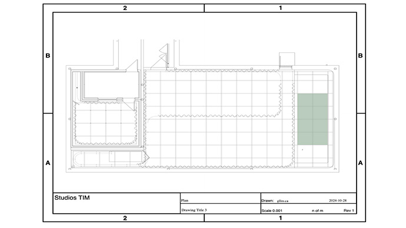 
*schéma fait par Luminatura*

<ins>source :</ins> https://miaou-mafia.github.io/projet-luminatura/#/30_production/60_plantation/

## ressenti
### positif
Je trouvais ça très beau visuellement, les couleurs, le son, etc. Je trouvais ça très pertinent aussi qu'il y ait trois plaquettes pour pouvoir vraiment jouer avec les couleurs, permettant à trois personnes de participer en même temps. On ressentait vraiment que nous contrôlions les couleurs avec notre aura intérieure.
### négatif
J'ai moins aimé le fait qu'il n'y ait plus de nouveautés trop rapidement. Pour ma part, lorsqu'une plaquette était touchée, c'était toujours la même couleur, et pareil lorsque deux ou trois plaquettes étaient activées en même temps. Il manquait de variété.
### recommadation
Je recommande Luminatura à toute personne adorant les activités où le décor est très joli et rempli de couleurs.

#  
## Équipe
- <ins>**Joshua Gonzalez-Barrera</ins> :** Programmeur, Monteur vidéo, Artiste design
- <ins>**Victor Gileau</ins> :** Programmeur, Artiste design
- <ins>**Michael Un Dupré</ins> :** Programmeur, Artiste VFX/design
- <ins>**Pierre-Luc Proul</ins> :** Programmeur, Artiste VFX/design, Artiste 3D
- <ins>**Maik Hamel</ins> :** Programmeur, Compositeur sonore
## l'installation en cours (ou finale)
Etheria est présentement finalisée. Voici quelques photos pour vous montrer visuellement Etheria ainsi que sa fiche explicative.
### Fiche

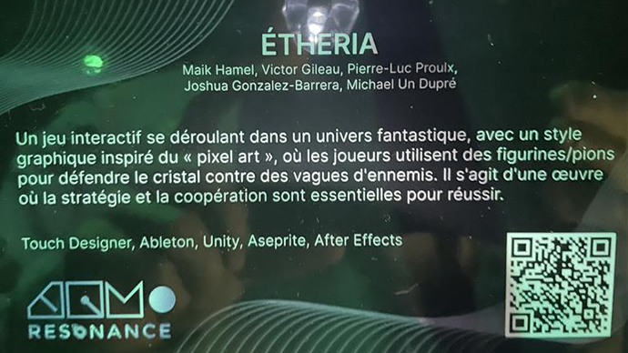 
*photo prise par moi*
### Photos à l'appui
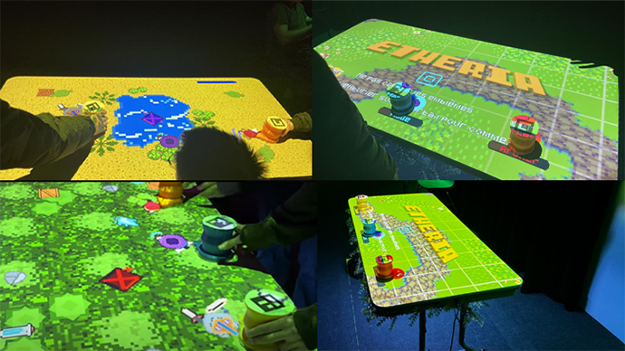 
*photos du haut prises par moi* 
*photos du bas prises par Étheria*
## schéma de l'installation prévue
Voici le schéma réalisé par Etheria, nous montrant la structure vue de haut prévue par l'équipe ainsi que leur nouvelle version du schéma.

### Vu du haut
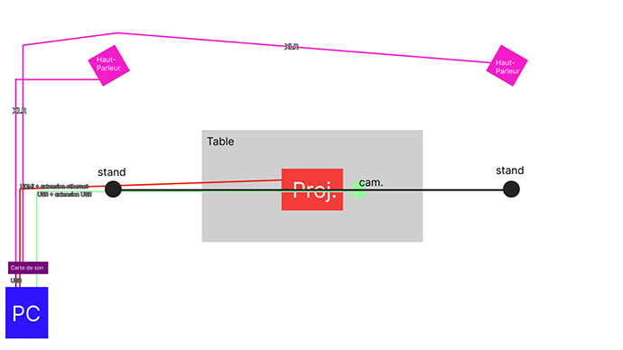 
*Schéma fait par Etheria*

### Nouvelle version
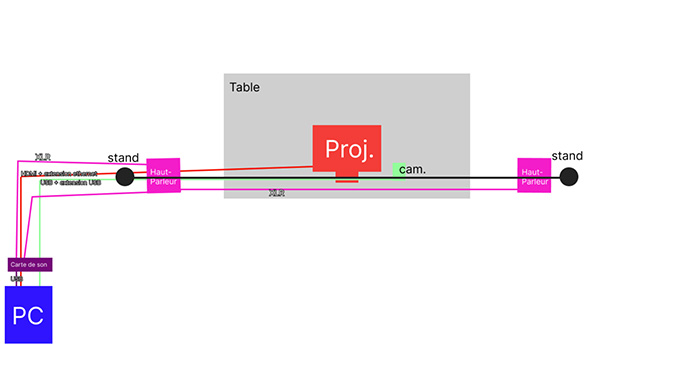 
*Schéma fait par Etheria*

<ins>Source :</ins>https://ethereal-creators.github.io/Etheria/#/30_production/60_plantation/
## ressenti
### Positif
Dispositif vraiment très amusant. Nous pouvons jouer jusqu'à 3 joueurs en équipe. Le jeu se joue très bien et l'idée des verres pour bouger son personnage est très spéciale. Le fait que chaque personnage soit différent et ait des pouvoirs différents rend le travail d'équipe plus pertinent.
### Négatif
Le jeu est un peu trop facile. J'ai joué deux fois avec deux équipes différentes et j'ai gagné les deux fois. Six niveaux, ce n'était pas assez. Un des créateurs du jeu m'a dit qu'à la base, ils voulaient en faire 10, mais que cela aurait été trop long.
### Recommandation
Je recommande Etheria à toute personne qui adore découvrir différentes manières de jouer à des jeux.

# 
## Équipe
- <ins>**Abdel Ali Djeral</ins> :** Programmeur
- <ins>**Daniel Dezemma</ins> :** Directeur visuel
- <ins>**Matis Labelle</ins> :** Chargé de projet
- <ins>**Tristan Khadka</ins> :** Directeur sonore
- <ins>**Yavuz-Selim Gucluer</ins> :** Programmeur
## l'installation en cours (ou finale)
Fuga est présentement finalisée. Voici quelques photos pour vous montrer visuellement Fuga ainsi que sa fiche explicative.
### Fiche
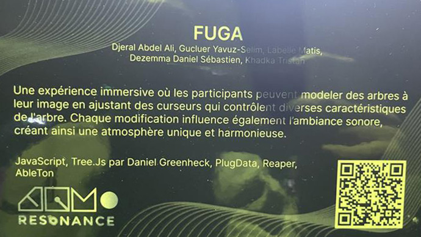 
*photo prise par moi*

### Photos à l'appui
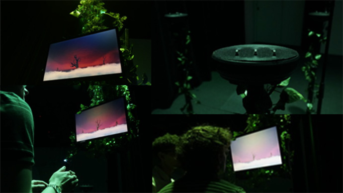 
*photos prises par Fuga*
## schéma de l'installation prévue
Voici le schéma réalisé par Fuga, nous montrant la structure vue de haut, de coté et de face par l'équipe.
### Face
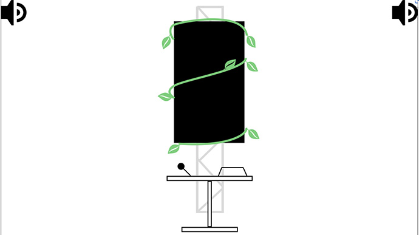 
*Schéma fait par Fuga*

### Haut
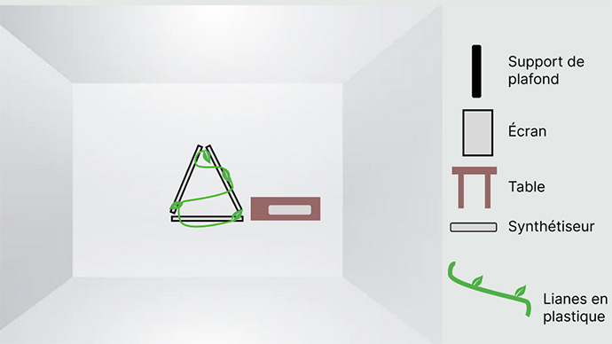 
*Schéma fait par Fuga*

### Coté
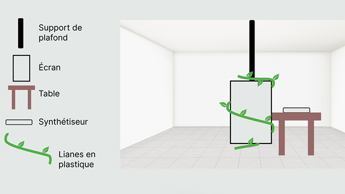 
*Schéma fait par Fuga*

<ins>Source :</ins>https://escapism-fuga.github.io/Fuga/#/30_production/60_plantation/
## ressenti
### Positif
Je trouve l'idée assez créative de pouvoir vraiment modeler son arbre de plusieurs façons. Il y a énormément de possibilités, je ne pense pas avoir fait le tour des options, ce qui, pour moi, donne des points à Fuga.
### Négatif
Je trouve que le fait que tout se passe sur un écran rend l'expérience moins amusant, car on ne peut pas vraiment voir les autres faire. Sur un écran, j'ai l'impression de faire une activité chez moi, seul, dans ma chambre.
### Recommandation
Je recommande Fuga à toute personne qui adore les jeux de création avec plusieurs possibilités.

#  
## Équipe
- <ins>**Kenza El Harrif</ins> :** Directrice artistique, Conception sonore, design visuel
- <ins>**Isaac Fafard</ins> :** Intégrateur multimédias, Programmeur
- <ins>**Khaly Tia Sing</ins> :** Chargée de projet, Intégratrice multimédias
- <ins>**Delphine Grenier</ins> :** Gestionnaire de projet, Programmeuse
- <ins>**Sitmonternna Yi</ins> :** Gestion des ressources techniques, Conception sonore
## l'installation en cours (ou finale)
Internature est présentement finalisée. Voici quelques photos pour vous montrer visuellement Internature ainsi que sa fiche explicative.
### Fiche
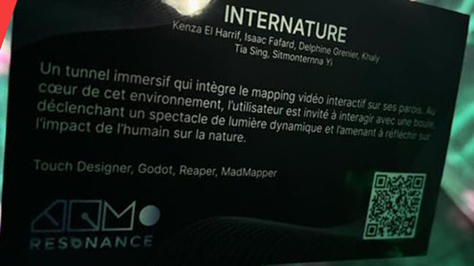 
*photo prise par Cyrine Ghiat*

### Photos à l'appui
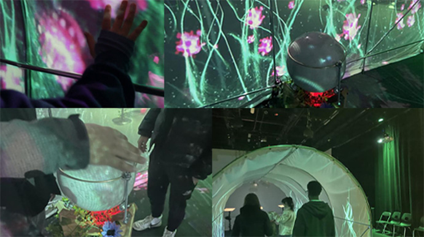 
*Première photo du haut à gauche prise par Internature* 
*Autre photos prises par moi*
## schéma de l'installation prévue
Voici le schéma réalisé par Internature, nous montrant la structure du studio, de le sphère et de différentre serre par l'équipe.

### Serre - studio
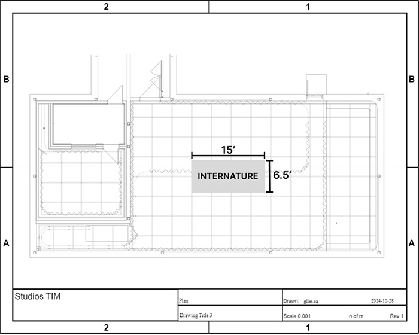 
*Schéma fait par Internature*

### Serre - vue 3D
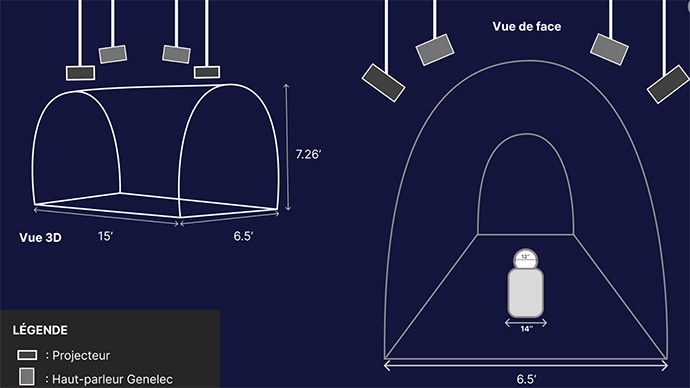 
*Schéma fait par Internature*

### Serre - vue de haut
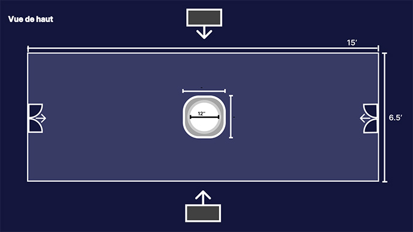 
*Schéma fait par Internature*

### Sphère
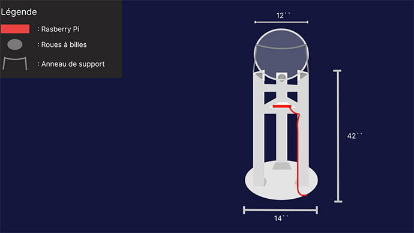 
*Schéma fait par Internature*

### Serre - connecteurs
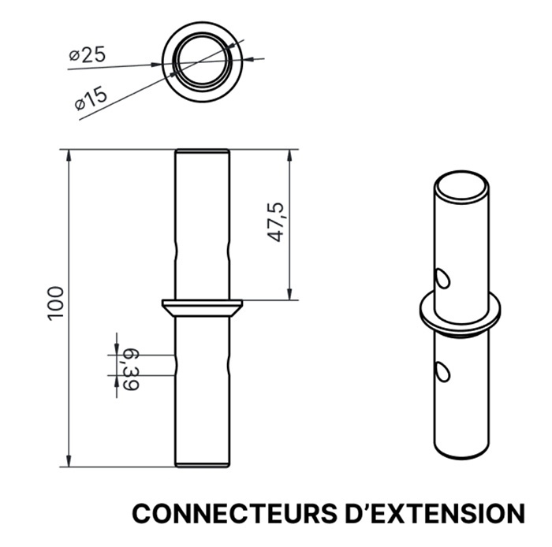 
*Schéma fait par Internature*

<ins>source :</ins>https://tprangers.github.io/internature/#/30_production/60_plantation/
## ressenti
### Positif
Couleurs très harmonieuses et chaleureuses. L'idée de la sphère m'a épater. Je trouvais ça drôle, je voyais les gens, on dirait qu'ils étaient des voyants, et en agitant la sphère, ils faisaient bouger les couleurs partout autour de nous. C'était très beau.
### Négatif
J'ai cru avoir compris qu'il fallait parfois un certain temps pour régénérer la sphère. À mon tour d'essayer, elle ne marchait pas...
### Recomandation
Je recommande Internature à tous ceux qui sont amateurs d'expériences immersives remplies de couleurs.

# 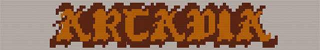
### Équipe
- <ins>**Dominic Yale</ins> :** Conception sonore
- <ins>**William Beauvais</ins> :** Conception visuelle
- <ins>**Anton Nikulin</ins> :** Programmeur
### l'installation en cours (ou finale)
Arcadia est présentement en cours. Voici quelques photos pour vous montrer visuellement Arcadia ainsi que sa fiche explicative.
### Fiche
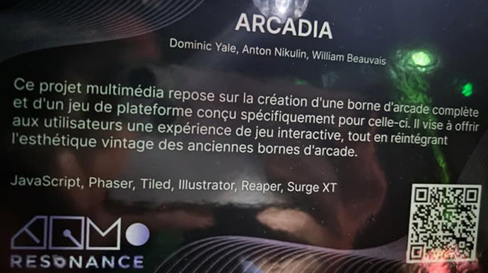 
*photo prise par Cyrine Ghiat*

### Photos à l'appui
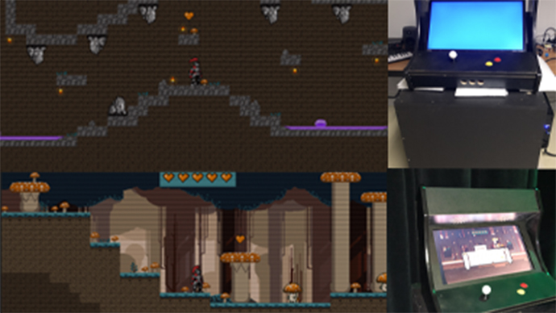 
*photo prise par Arcadia*
### schéma de l'installation prévue
Voici le schéma réalisé par Arcadia, nous montrant la l'emplacement pour Arcadia.
### Emplacement
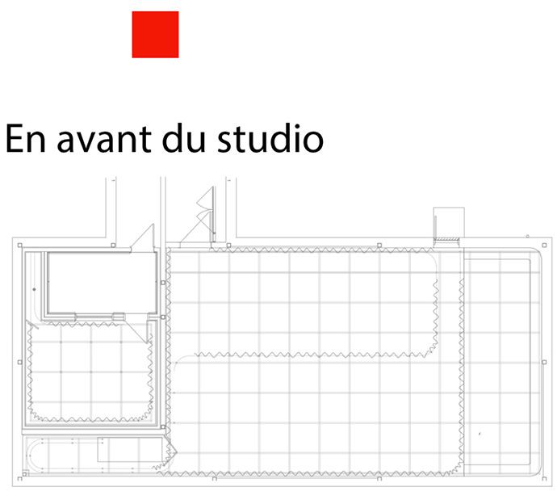 
*Schéma fait par Arcadia*

<ins>/Source :</ins>https://cousi-cousa.github.io/Arcadia/#/30_production/60_plantation/
## ressenti
Je n'ai pas de ressenti. Le dispositif a l'air plaisant, mais lorsque je me suis présenté, il n'était pas fonctionnel et il n'y avait personne de présent, donc je n'ai pas pu l'essayer ou même le voir ouvert.

# cours incontournables
Selon moi, trois cours primordiaux pour réaliser ce genre de projet sont la programmation, car dans tous les projets, il y a de la programmation. Je dirais aussi qu'il est très important de suivre des cours d'audio, car tous les projets avec de l'audio ajouté sont beaucoup plus immersifs et plaisants. En regardant la liste des cours, je pense que le traitement audiovisuel serait également primordial, car on y apprend à créer des effets et des réactions en temps réel.

# technique ou une composante technologique apprise
Je ne connaissais pas LiDAR, "Capteurs avancés permettant une cartographie 3D en temps réel de l’espace environnant, détectant les distances et les mouvements à distance." Grâce à mes recherches, j'ai appris que LiDAR permet justement de capter en temps réel à l'aide de la lumière. Il utilise la lumière pour faire une estimation de la distance. LiDAR est utilisé dans les nouvelles voitures de nos jours pour détecter où sont les voitures autour de soi. Je m'étais toujours demandé comment c'était aussi précis ! Un bel apprentissage.

