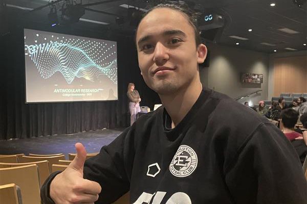

# Rencontre Jade Ségula   
### *25 mars 2025 - 12h30-14h00 - Salle Claude Legault `(B1346)`*

 
moi à la conférence `*photo prise par moi*`

## Jade Ségula 

Jade Séguéla est une professionnelle passionnée par l’univers des musées et des arts numériques. Elle détient une maîtrise en muséologie (2019) et un baccalauréat en arts numériques (2017) de l’Université Concordia, où elle a approfondi ses connaissances dans ces deux domaines qui la fascinent. Son parcours académique et professionnel l'a conduite à collaborer avec plusieurs institutions artistiques importantes, telles que le Musée d'art contemporain de Montréal et Eastern Bloc, ainsi que des organismes comme Tohu, le Château Dufresne et l’Institut du Patrimoine de l’UQAM.

En plus de sa pratique professionnelle, Jade est également une communicante hors pair. Elle anime des conférences et des présentations, où elle a partagé ses connaissances sur l'art interactif et les œuvres de Lozano-Hemmer. À travers son travail, Jade Séguéla se positionne comme un pont entre l’art, la technologie et le public, cherchant à rendre l’art contemporain plus accessible et engageant pour tous.

## Lozanho-Hemmer

Rafael Lozano-Hemmer est un artiste d'origine mexicaine, né en 1967 à Mexico. Reconnu pour ses installations interactives, il explore à travers son travail l'intersection entre l'art, la technologie et l'architecture. Son parcours est marqué par une approche innovante, où il intègre des éléments de la science, des lumières robotiques, des systèmes de fontaines numériques et des réseaux télématiques dans ses œuvres. Avant de devenir artiste, Lozano-Hemmer a étudié la chimie physique à l’Université Concordia à Montréal, une formation qui a profondément influencé sa façon de penser l’art, en alliant la rigueur scientifique à la créativité artistique.

## Conférence

Lors de la conférence, Jade a présenté non seulement les projets de Lozano-Hemmer, mais aussi la philosophie qui sous-tend son travail : l’importance de l’interaction, de la participation du public et de la fusion entre art et technologie. Elle a décrit des œuvres marquantes comme `Cloud Display`,`Binocular Tension`, `Shadow Hunter`, et enfin, `Sphere Packing`.

## Oeuvre présentée

- ### Cloud Display 
 qui matérialise les mots en fumée

- ### Binocular Tension 
les spectateurs sont observés par des yeux géants

- ### Shadow Hunter 
 une installation où les ombres des passants influencent la diffusion d’une radio

- ### Sphere Packing 
une œuvre sonore immersive qui joue des compositions de Bach dans une sphère géante.

## Appréciation

Personnellement, j'ai bien aimé la conférence. Pour commencer, j'ai trouvé mes sièges très confortables, j'étais bien installé. Plus sérieusement, je ne connaissais ni Jade Séguéla ni Rafael Lozano-Hemmer, ni ce qu'ils faisaient dans la vie. J'aime beaucoup la technologie et, depuis que je suis dans la technique, j'apprends beaucoup sur l'art. Je trouve cela très intéressant de voir un mélange entre les deux. J'ai aussi beaucoup aimé qu'elle nous parle de certains de ses projets, car cela m'a vraiment intrigué et donné envie d'en apprendre davantage sur des projets que je n'aurais probablement pas connus autrement.

En résumé, cette conférence m'a permis d'acquérir encore plus de repères et de profondeur dans mes connaissances des médias numériques, ainsi que dans les possibilités de ce que l'on peut réaliser avec ces technologies.

